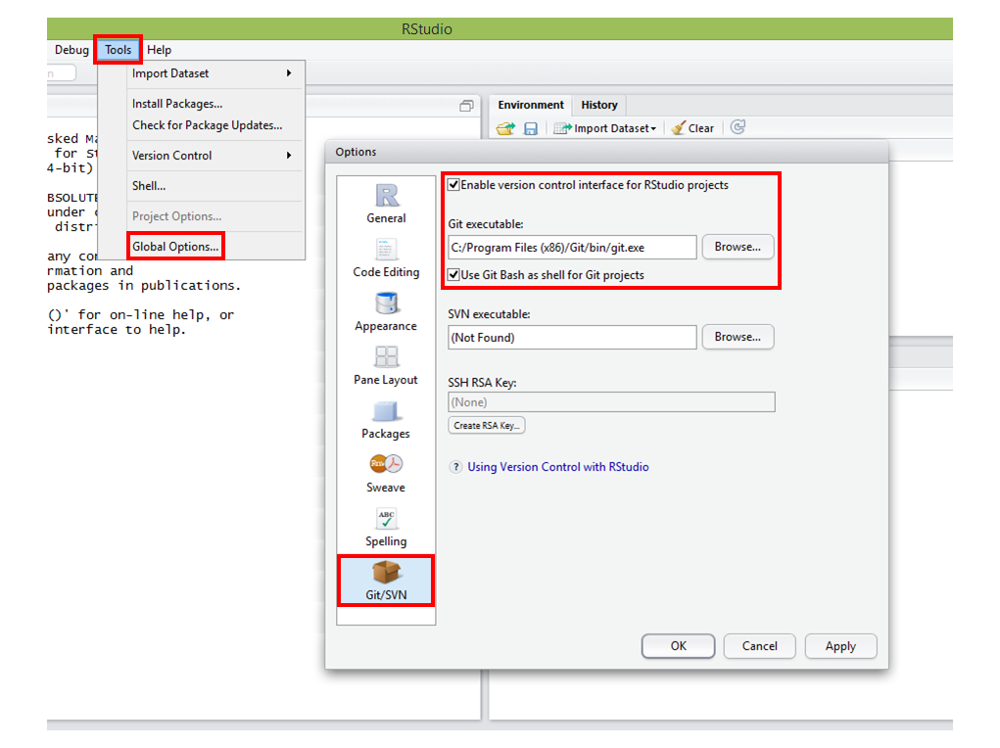

```{r knitsetup, echo=FALSE, results='hide', warning=FALSE, message=FALSE, cache=FALSE}
opts_knit$set(base.dir='./', fig.path='', out.format='md')
opts_chunk$set(prompt=TRUE, comment='', results='markup')
# See yihui.name/knitr/options for more Knitr options.
##### Put other setup R code here


# end setup chunk
```


4) Baixe e instale o [R](http://cran.rstudio.com/)

5) Baixe e instale o [Rstudio](http://www.rstudio.com/)

6) Abra o Rstudio e configure o caminho para o executavel do Git:
``` 
Tools -> Global Options... -> Git/SVN 

Windows 7 ou anterior - "C:/Program Files (x86)/Git/git.exe"

Windows 8.1 - "C:/Users/<Usuário>/AppData/Local/GitHub/PortableGit_<VáriosCaracteresAleatórios>/bin/git.exe"
(Esta pasta fica escondida)
```
 

7) Reinicie o RStudio
