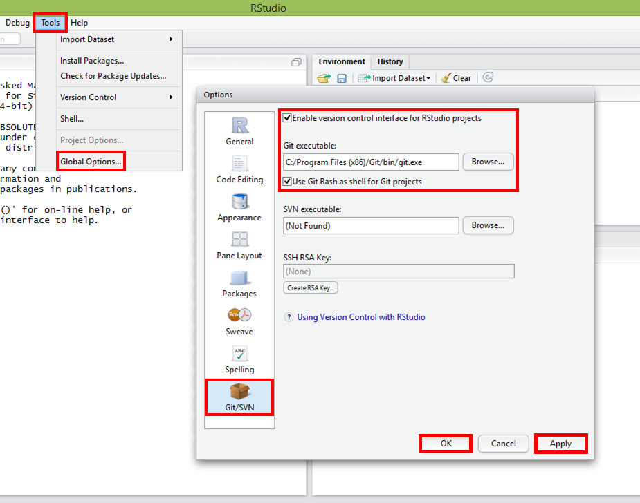

```{r knitsetup, echo=FALSE, results='hide', warning=FALSE, message=FALSE, cache=FALSE}
opts_knit$set(base.dir='./', fig.path='', out.format='md')
opts_chunk$set(prompt=TRUE, comment='', results='markup')
# See yihui.name/knitr/options for more Knitr options.
##### Put other setup R code here


# end setup chunk
```
# R e RStudio


## O que é R?
R é uma linguagem de programação e um ambiente para realização de cálculos estatísticos e a criação de gráficos. Além de ser a base para o RStudio.

## O que é RStudio?
RStudio é um ambiente de desenvolvimento integrado (IDE, do inglês, *Integrated Development Environment*) para o R, ou seja, é um conjunto de ferramentas desenvolvidas para ajudá-lo a ser mais produtivo com o R. Dentre as suas ferramentas, destacam-se o editor com a funcionalidade de realce de sintaxe, a visualização dos objetos carregados no ambiente de trabalho e a integração com sistemas de controle de versão.

## Instale e configure o R e o RStudio em 5 passos
Agora que você já sabe o que é o R e o RStudio, vamos continuar a nossa instalação:

1) Baixe e instale o [R](http://cran.rstudio.com/).

2) Baixe e instale o [Rstudio](http://www.rstudio.com/).

3) Abra o **Rstudio** e configure o caminho para o executável do Git, indo em: **Tools** -> **Global Options...** -> **Git/SVN** e no campo **Git Executable**, insira o caminho para o executável do Git:

* Windows 7 ou anterior - ``C:/Program Files (x86)/Git/git.exe``

* Windows 8.1 - ``C:/Users/<Usuário>/AppData/Local/GitHub/PortableGit_{{VáriosCaracteresAleatórios}}/bin/git.exe``
**Atenção!** A pasta **PortableGit_{{VáriosCaracteresAleatórios}}** tem um nome que varia de computador para computador. Além disso, o executável fica numa pasta oculta pelo sistema, portanto lembre-se de habilitar a opção de ver os arquivos ocultos.

 

4) Clique em **Apply** e em seguida, em **OK**.

5) Feche e abra o **RStudio**, para garantir que as suas novas configurações tenham sido aplicadas.
