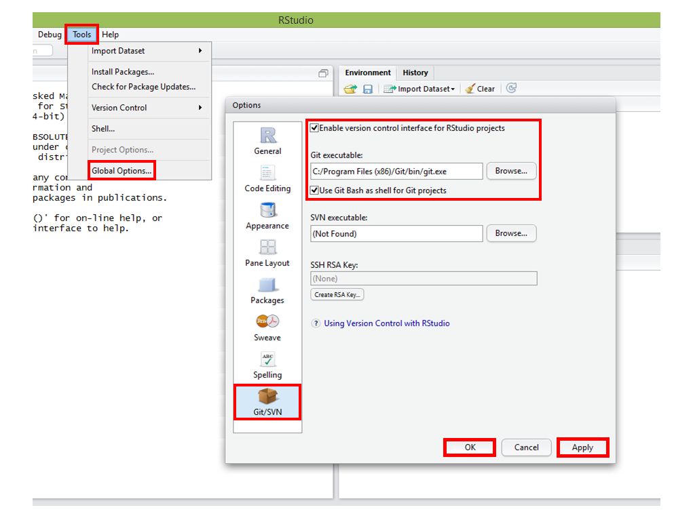

# R e RStudio

## O que é o R?

## O que é o RStudio?

## Instale e configure o R e o RStudio em 5 passos
Agora que você já sabe o que é o R e o RStudio, vamos continuar a nossa instalação:

1) Baixe e instale o [R](http://cran.rstudio.com/).

2) Baixe e instale o [Rstudio](http://www.rstudio.com/).

3) Abra o **Rstudio** e configure o caminho para o executável do Git, indo em **Tools** -> **Global Options...** -> **Git/SVN** e no campo **Git Executable**, insira o caminho para o executável do Git:

* Windows 7 ou anterior - ``C:/Program Files (x86)/Git/git.exe``

* Windows 8.1 - ``C:/Users/<Usuário>/AppData/Local/GitHub/PortableGit_<VáriosCaracteresAleatórios>/bin/git.exe``
**Atenção!** A pasta **PortableGit_...** tem um nome que varia de computador para computador. Além disso, o executável fica numa pasta oculta pelo sistema, portanto lembre-se de habilitar a opção de ver os arquivos ocultos.

 

4) Clique em **Apply** e em seguida, em **OK**.

5) Feche e abra o **RStudio**, para garantir que as suas novas configurações tenham sido aplicadas.
