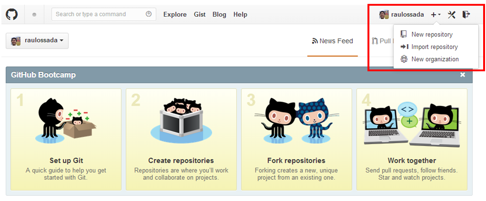
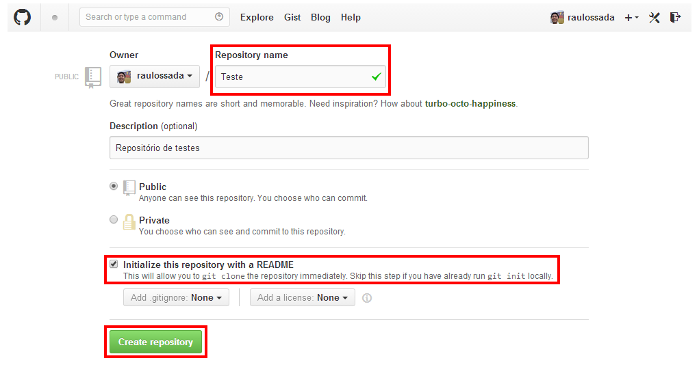
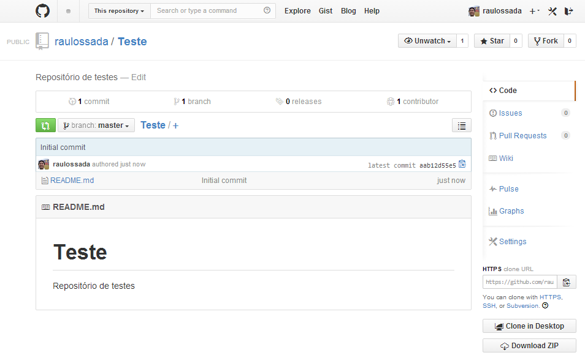

```{r knitsetup, echo=FALSE, results='hide', warning=FALSE, message=FALSE, cache=FALSE}
opts_knit$set(base.dir='./', fig.path='', out.format='md')
opts_chunk$set(prompt=TRUE, comment='', results='markup')
# See yihui.name/knitr/options for more Knitr options.
##### Put other setup R code here


# end setup chunk
```
2.1) Acesse a sua conta no [Github](https://github.com/) e selecione a opção **New repository**:


- - -

2.1.1) Dê um nome para o seu repositório

2.1.2) Marque a opção: **"Initialize this repository with a README"**


- - -

2.1.3) Parabéns! O seu repositório foi criado com sucesso!

