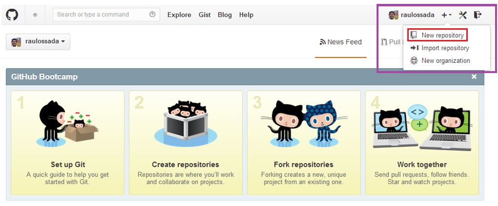
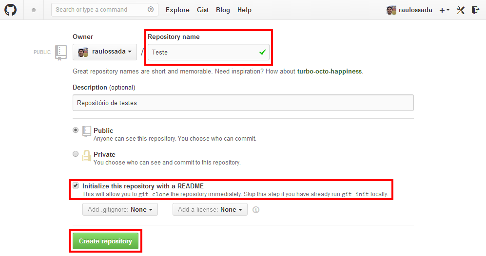
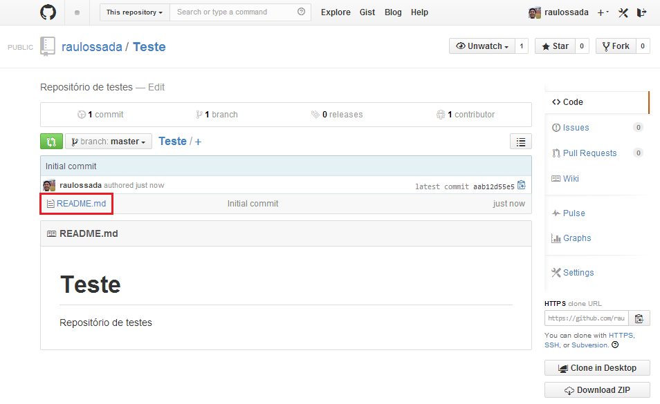

# Criando um repositório

1) Acesse a sua conta no [Github](https://github.com/) e selecione a opção **New repository**:

***

2) Dê um nome para o seu repositório.

3) Marque a opção: **"Initialize this repository with a README"**.

4) Clique em **Create Repository**:

***

Parabéns! Acabamos de criar um repositório com sucesso!

