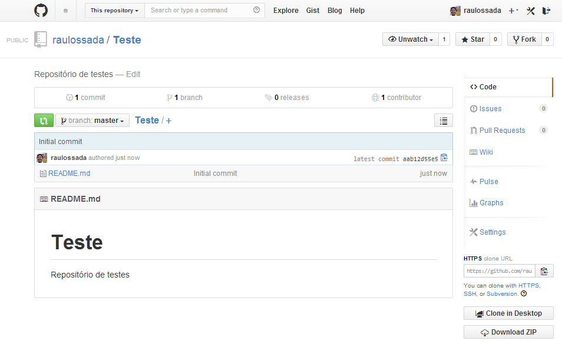

2.1) Acesse a sua conta no [Github](https://github.com/) e selecione a opção **New repository**:

- - -

2.1.1) Dê um nome para o seu repositório

2.1.2) Marque a opção: **"Initialize this repository with a README"**

- - -

2.1.3) Parabéns! O seu repositório foi criado com sucesso!

