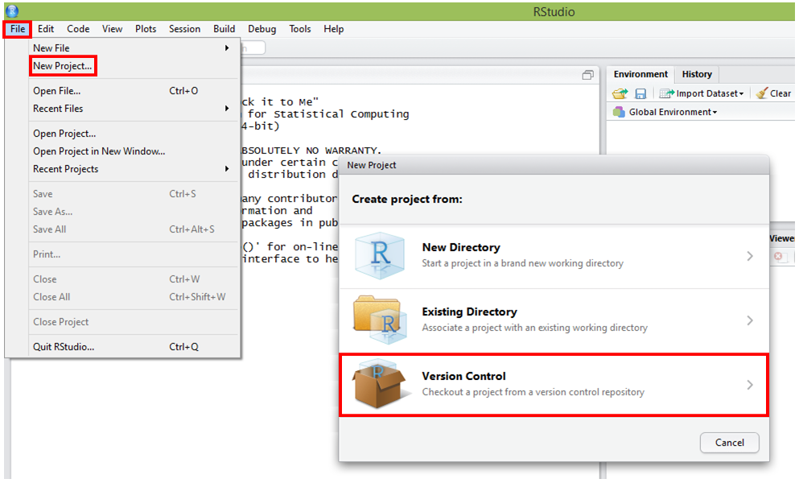
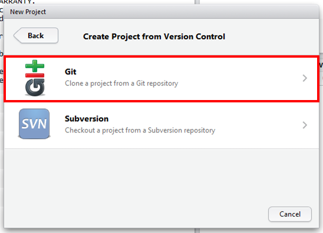
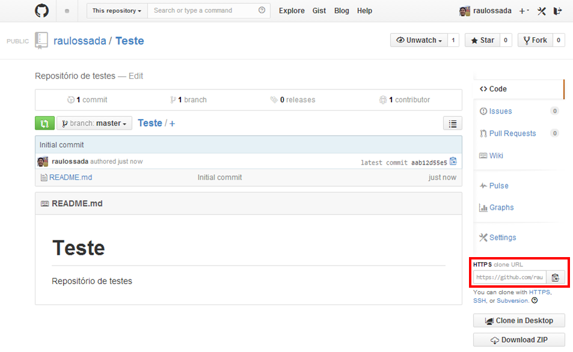
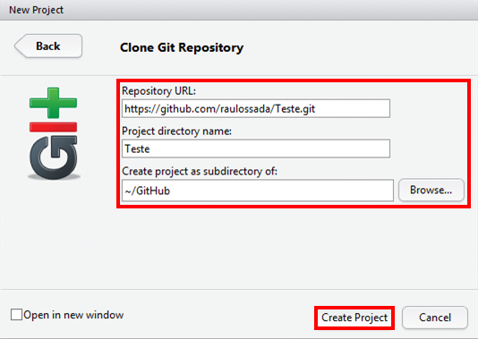
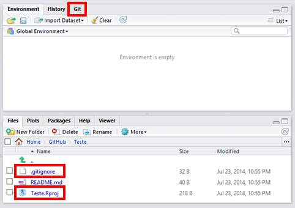

```{r knitsetup, echo=FALSE, results='hide', warning=FALSE, message=FALSE, cache=FALSE}
opts_knit$set(base.dir='./', fig.path='', out.format='md')
opts_chunk$set(prompt=TRUE, comment='', results='markup')
# See yihui.name/knitr/options for more Knitr options.
##### Put other setup R code here


# end setup chunk
```
# Associando um repositório

Nesta seção, vamos ver como associar um repositório do GitHub à um projeto do RStudio.

1) Abra o **RStudio**. E vá em: **File** -> **New project...** -> **Version Control**:



***

2) Selecione a opção **Git**:



***

3) Acesse o seu repositório no [GitHub](https://github.com/) e copie o **HTTPS clone URL**:



***

4) Cole o **HTTPS clone URL** do seu repositório no campo **Repository URL**.

5) Recomenda-se deixar o campo **Project directory name** com o mesmo nome do seu repositório.

6) No campo **Create project as subdirectory of**, através do botão **Browse...**, escolha o local onde deseja criar a pasta que irá conter os arquivos do seu repositório.

7) Clique em **Create Project**:



***

Parabéns! Conseguimos associar um repositório do GitHub à um projeto do RStudio!

**Note** que a aba **Git** foi adicionada, ao lado das abas Environment e History. E que o arquivo ``README.md`` foi pego do repositório do GitHub e salvo localmente no seu computador:



Além disso, foram criados 2 arquivos:

* O ``.gitignore``, que contém uma lista com os arquivos que não serão versionados pelo GitHub:
```
.Rproj.user
.Rhistory
.RData
```

* E o ``Teste.Rproj``, que é o arquivo do RStudio que salva as informações do seu projeto.
