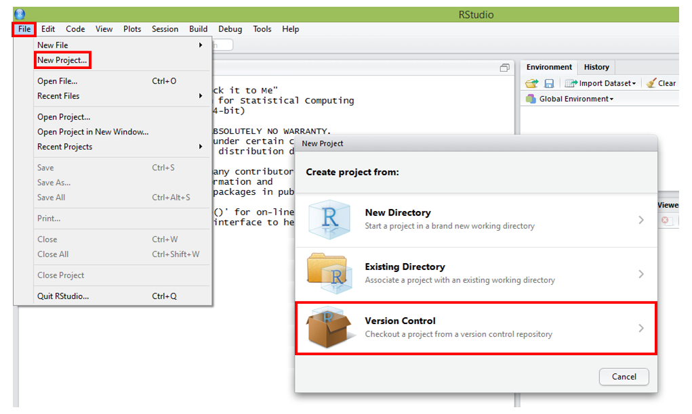
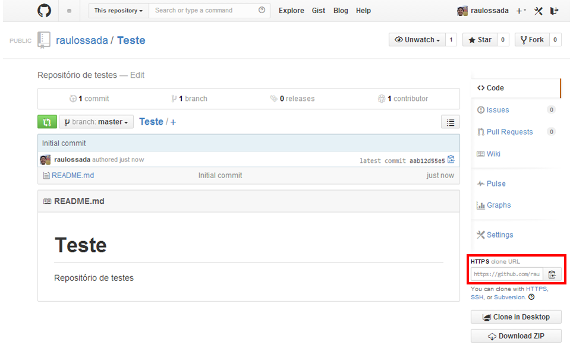
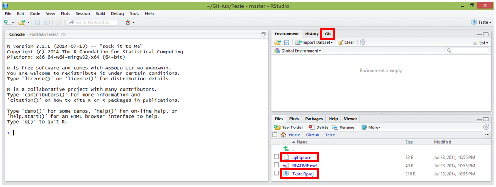

2.2) Acesse o RStudio e associe um projeto ao seu repositório do Github

File -> New project... -> Version Control -> Git -> 

Repository URL

Create project as subdirectory of:

Create Project



Selecione a opção **"Git"**:


Acesse o seu repositório e copie o **HTTPS clone URL**:


Cole o **HTTPS clone URL** do seu repositório no campo **Repository URL**:


Recomenda-se deixar o campo **Project directory name** com o mesmo nome do seu repositório.

No campo **Create project as subdirectory of**, através do botão **Browse...**, escolha o local onde deseja criar a pasta que irá conter os arquivos que estão no seu repositório.

Crie seu projeto associado ao seu repositório do Github clicando no botão: ``Create Project``.

Parabéns! Você acaba de associar um repositório do Github à um projeto do RStudio.


Note que o RStudio criou 2 arquivos:

* O ``.gitignore``, que contém uma lista de arquivos que não serão versionados pelo Github:
```
.Rproj.user
.Rhistory
.RData
```

* E o ``Teste.Rproj``, que é o arquivo do RStudio que salva as informações do seu projeto.

* Além disso, adicionou também a aba
**Git**, ao lado as abas **Environment** e **History**:
