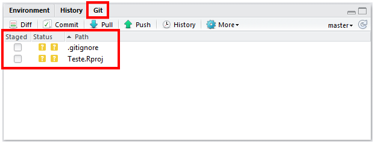
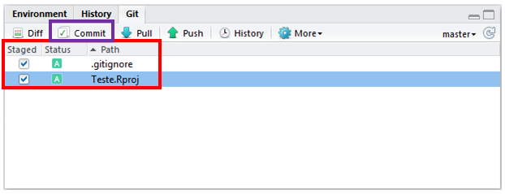
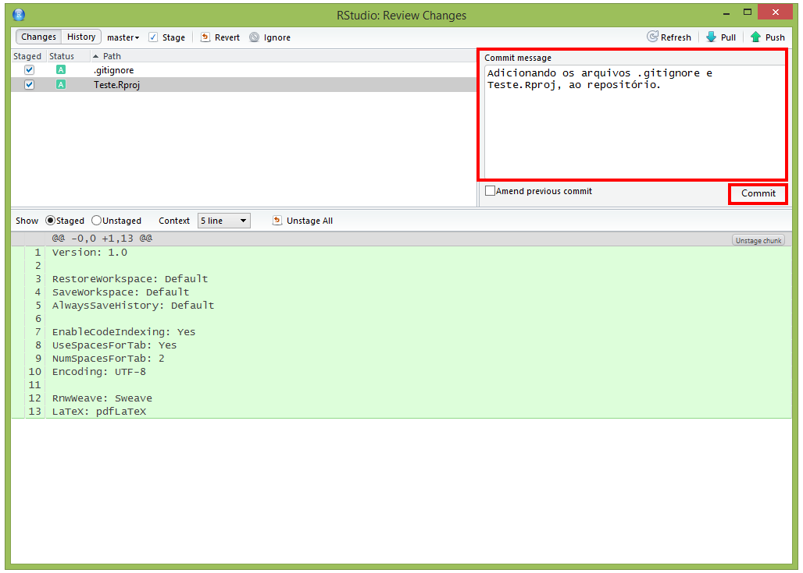
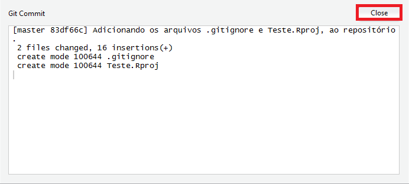
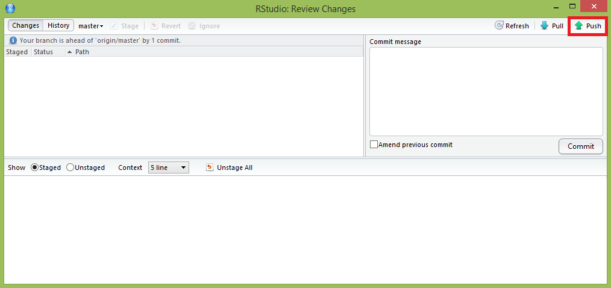
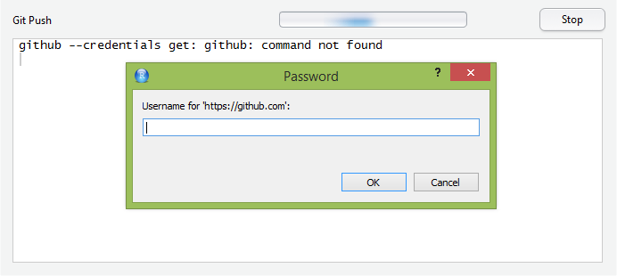
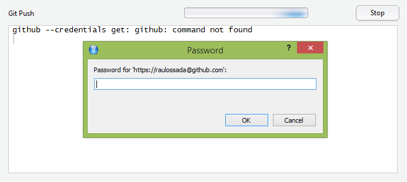
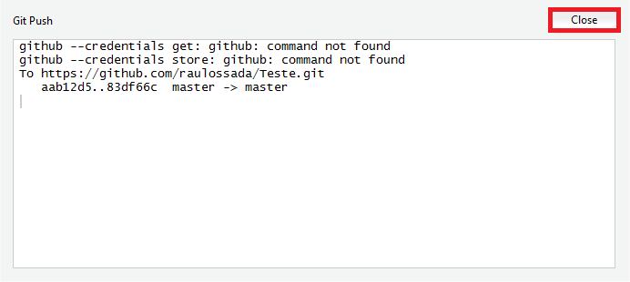
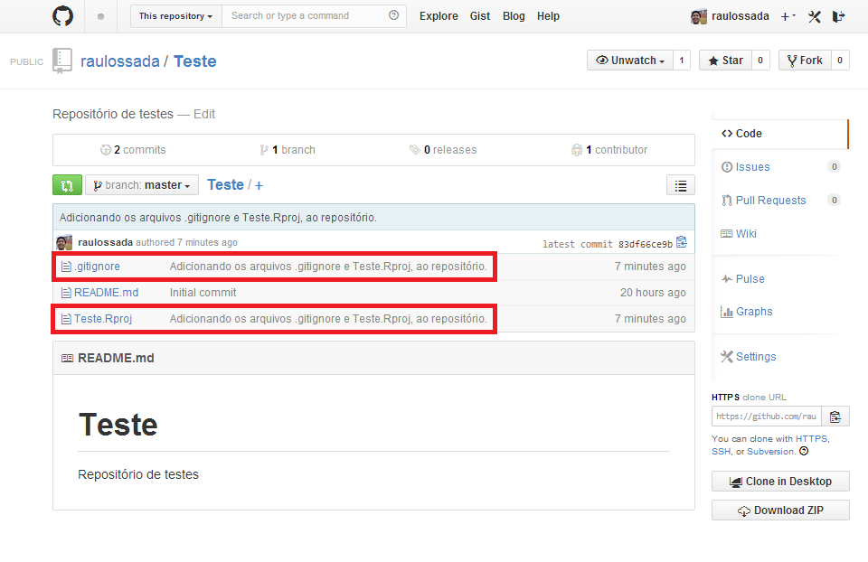

```{r knitsetup, echo=FALSE, results='hide', warning=FALSE, message=FALSE, cache=FALSE}
opts_knit$set(base.dir='./', fig.path='', out.format='md')
opts_chunk$set(prompt=TRUE, comment='', results='markup')
# See yihui.name/knitr/options for more Knitr options.
##### Put other setup R code here


# end setup chunk
```
# Fazendo um commit e um push


No RStudio, clique na aba **Git**:



Note que nesta aba aparecem os arquivos ``.gitignore`` e ``Teste.Rpoj``. E que o **Status** destes dois arquivos é **Untracked** (O Símbolo de interrogação envolto por uma caixa amarela) - Não Rastreado = Não Versionado. 

- - -

Marque a coluna **Staged** (Organizados) dos dois arquivos, para indicar quais arquivos estão prontos para serem versionados. Note que o **Status** e o símbolo deles mudou para **Added** (A letra A envolvida por uma caixa verde) - Adicionado.

E clique no botão **Commit**, para indicar que o conjunto de arquivos selecionados anteriormente devem ser versionados:


 - - -

A seguinte janela irá aparecer.

Nela, você obrigatoriamente deve [é obrigado a] digitar uma mensagem de Commit (**Commit message**). A idéia desta mensagem é descrever brevemente as modificações que você pretende versionar.

Em seguida, clique no botão **Commit**.


- - -

A seguinte janela irá aparecer, indicando que o commit foi realizado e está pronto para ser enviado ao repositório.

Clique no botão **Close** (Fechar), para fechar essa janela.


- - -

Agora, vamos fazer um **Push** para o repositório, ou seja, vamos subir as alterações realizadas para o Github.

Para fazer isso, basta clicar no botão **Push**:


- - -

A seguinte janela irá aparecer, pedindo que você digite o seu ``Nome de Usuário`` (**Username**) do Github. Digite o seu nome de usuário, em seguida, clique no botão **OK**:


- - -

Na próxima janela, digite a sua ``Senha`` (**Password**) do Github e clique no botão **OK**:


- - -

A seguinte janela irá aparecer, indicando que o push foi realizado.

Clique no botão **Close**, para fechar essa janela.


- - -

Por fim, acesse a sua conta do [Github](https://github.com/), e verifique se arquivos estão no seu repositório:

Como podemos ver, os arquivos submetidos estão no repositório, e ao lado deles temos a mensagem de commit que digitamos anteriormente.

Parabéns! Você acaba de aprender como fazer um commit e um push do RStudio para o seu repositório no Github.

- - - 


