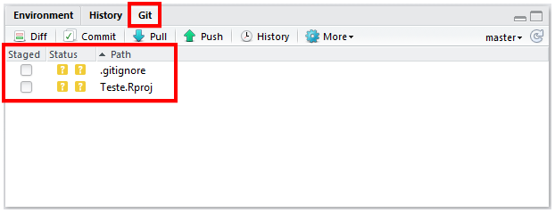
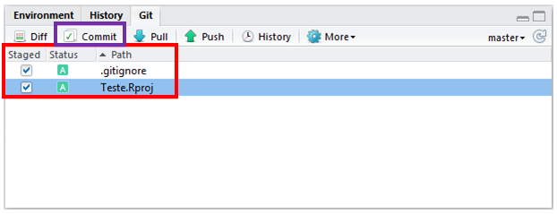
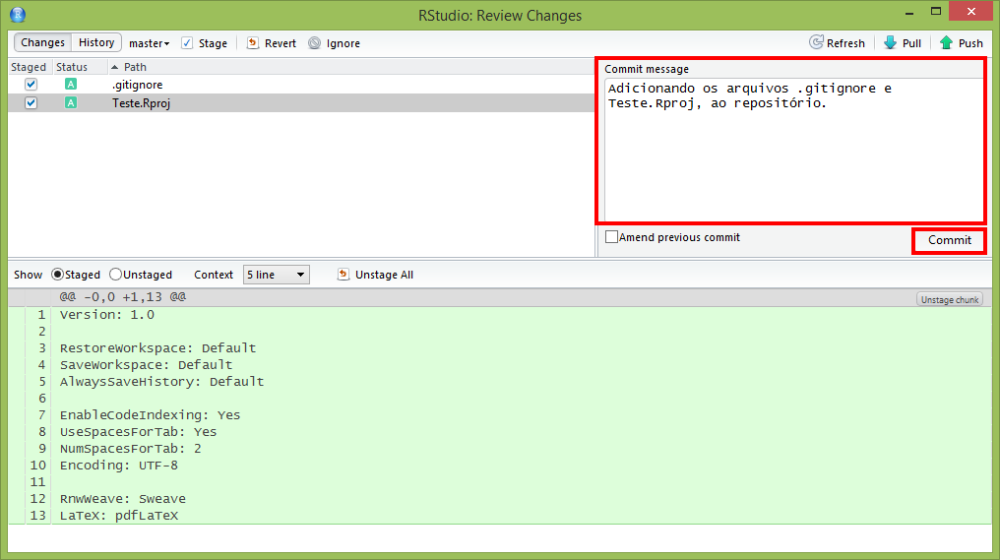
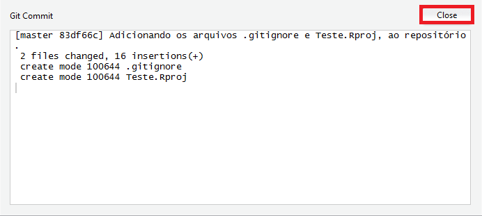
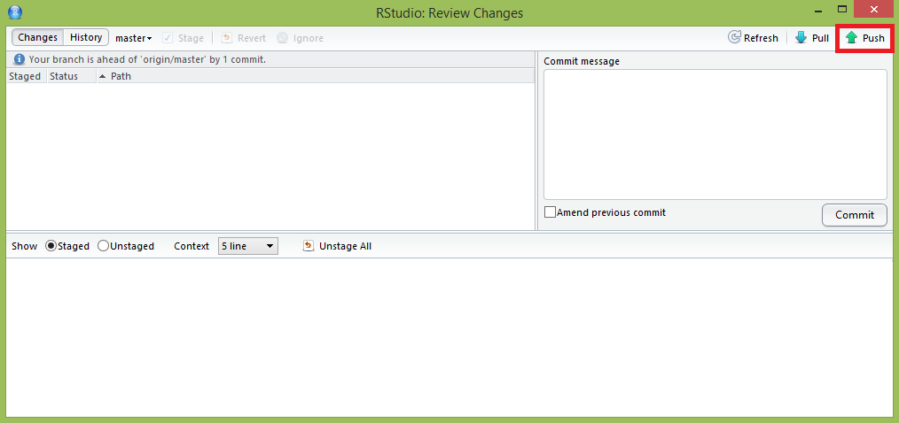
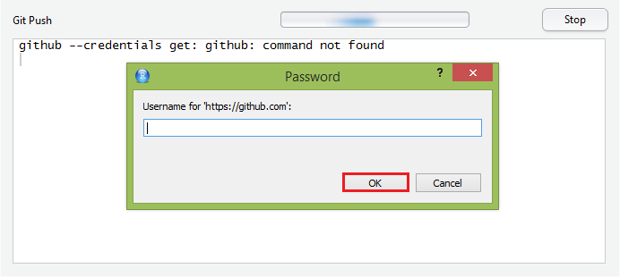
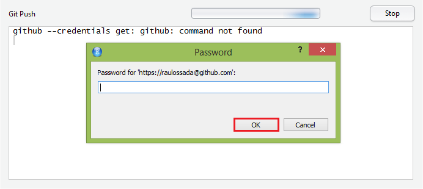
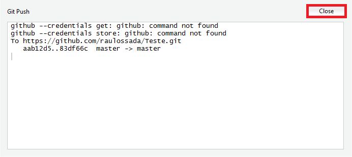
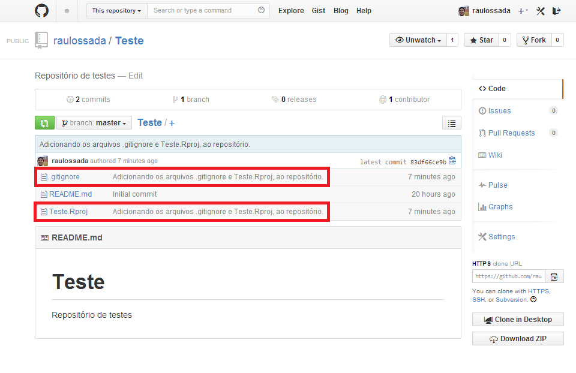

# Enviando arquivos à um repositório

Quando queremos enviar arquivos de um projeto do RStudio para um repositório do Github, precisamos conhecer dois termos que estão relacionados à esta ação:

1. **Commit** (do inglês, Submeter). Esse termo é usado quando o Git salva como estão todos os arquivos de um repositório num dado momento. Uma analogia, seria como se o Git tirasse uma foto do conteúdo de todos os arquivos num determinado instante.

2. **Push** (do inglês, Empurrar). Esse termo é usado quando se envia os arquivos do **Commit** para o repositório no Github.

## Fazendo um Commit

1) No **RStudio**, clique na aba **Git**:

Note que nesta aba aparecem os arquivos ``.gitignore`` e ``Teste.Rpoj``. E que o **Status** (do inglês, Estado) destes dois arquivos é **Untracked** (do inglês, Não Rastreado - indicando que estes arquivos ainda não foram versionados).

***

2) Marque a coluna **Staged** (do inglês, Organizados) dos dois arquivos. Note, que ao fazer isso, o **Status** deles muda para **Added** (do inglês, Adicionado - indicando que estes arquivos estão prontos para serem versionados).

3) Clique no botão **Commit**:

***

4) A seguinte janela irá aparecer. Nela, você deve, obrigatóriamente, digitar uma **Commit message** (do inglês, Mensagem de Commit), cujo objetivo é descrever brevemente as modificações que você acabou de fazer.

5) Em seguida, clique no botão **Commit**:

***

A seguinte janela irá aparecer, indicando que o **commit** foi realizado e está pronto para ser enviado ao repositório.

6) Clique no botão **Close** (do inglês, Fechar), para fechar esta janela.

## Fazendo um Push

Agora, vamos fazer um **Push** para o repositório, ou seja, vamos enviar as alterações realizadas para o repositório no Github.

7) Para fazer isso, clique no botão **Push**:

***

8) A seguinte janela irá aparecer. Nela, digite o seu **Username** (do inglês, Nome de Usuário) do Github. 

9) Em seguida, clique em **OK**:

***

10) Na próxima janela, digite o seu **Password** (do inglês, Senha) do Github.

11) E clique no botão **OK**:

***

A seguinte janela irá aparecer, indicando que o **push** foi realizado.

12) Clique no botão **Close**, para fechar essa janela.

***

13) Por fim, acesse o seu repositório no [Github](https://github.com/), e, por garantia, verifique se os arquivos estão lá:

Como podemos ver, os arquivos submetidos estão no repositório, e ao lado deles temos a Mensagem de Commit que digitamos anteriormente.

Parabéns! Acabamos de ver como fazer um **commit** e um **push** de arquivos de um projeto do RStudio para um repositório no Github.
