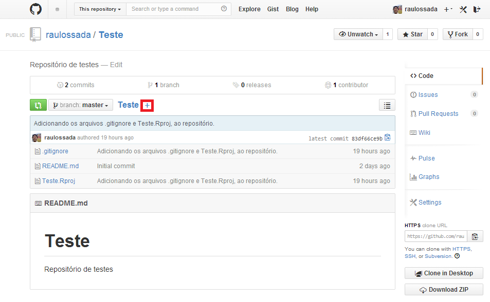
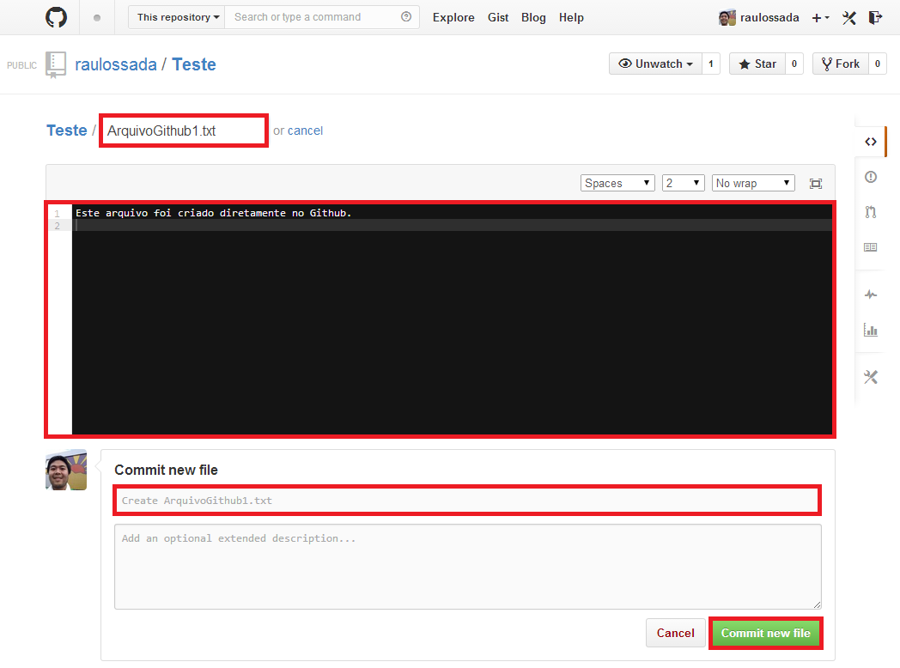
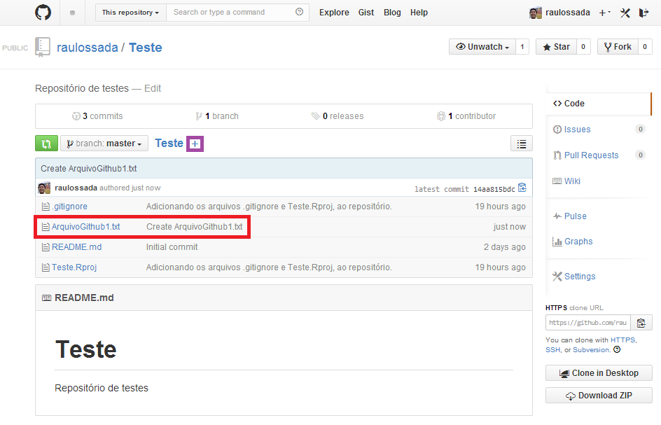
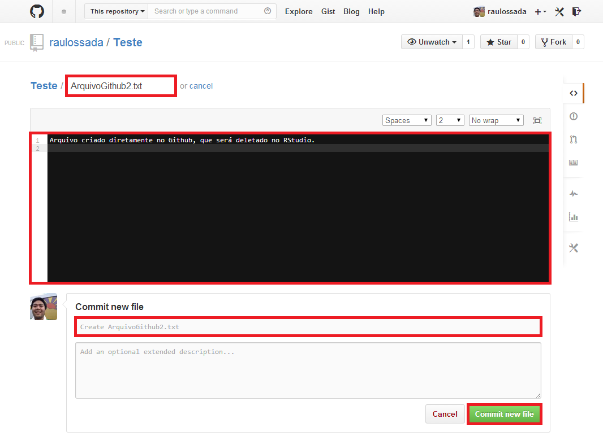
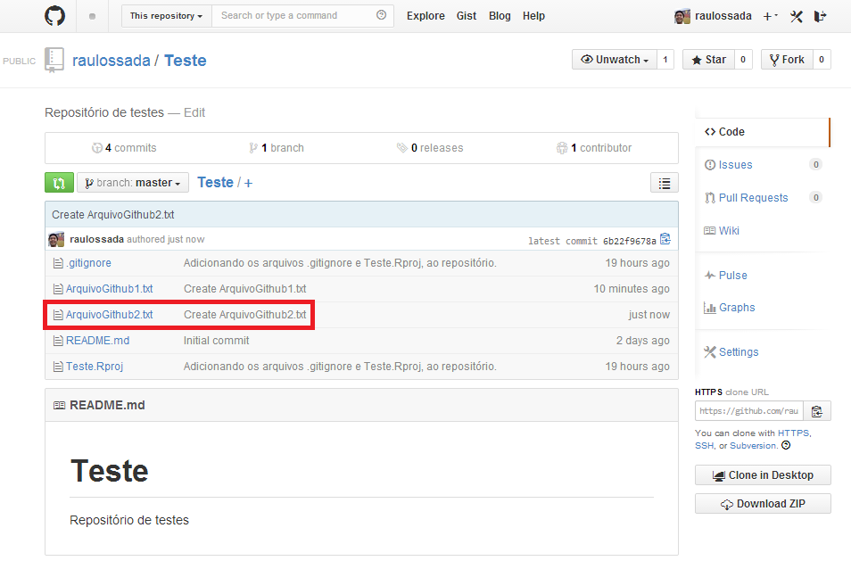
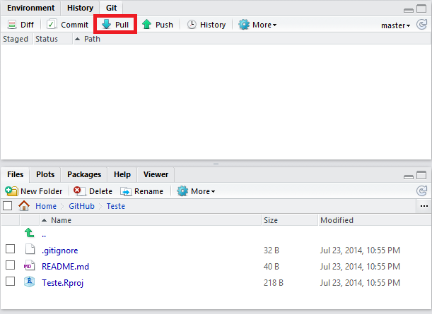
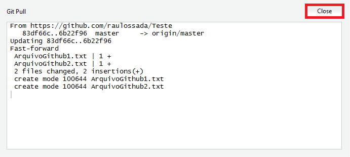
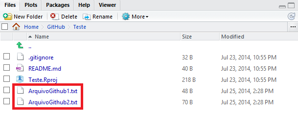

```{r knitsetup, echo=FALSE, results='hide', warning=FALSE, message=FALSE, cache=FALSE}
opts_knit$set(base.dir='./', fig.path='', out.format='md')
opts_chunk$set(prompt=TRUE, comment='', results='markup')
# See yihui.name/knitr/options for more Knitr options.
##### Put other setup R code here


# end setup chunk
```
# Fazendo um pull

Nesta parte, acesse o seu repositório no [Github](https://github.com/) e crie um novo arquivo.Para isso, clique no botão **+**:


- - -

Nesta tela, dê um nome para o seu arquivo.

Digite o conteúdo do arquivo.

Se você quiser, digite uma Mensagem de commit, caso contrário o Github irá criar usar uma mensagem padrão.

Clique no botão **Commit new file**, para finalizar a criação do arquivo:


- - -
 
Você será enviado para a tela inicial do seu repositório, e nele poderá observar que o arquivo foi criado.
 
Agora, vamos criar outro arquivo, usando o mesmo procedimento. Clique no botão **+**:

 
- - -
 
Dê um nome para o seu arquivo. Digite o conteúdo dele. E se quiser, digite uma mensagem de commit, ou use a mensagem automática do Github. Clique no botão **Commit new file**:

 
- - -
 
Confira se o arquivo foi criado no seu repositório:

 
- - -
 
Agora, volte para o seu projeto no RStudio.
 
Observe que nenhum dos 2 arquivos que acabamos de criar no Github aparecem no RStudio.

Para que os arquivos apareçam, precisamos fazer um **Pull** do repositório no Github, ou seja, pegar os arquivos que estão no repositório. Para isso, clique no botão ``Pull``:


- - -

A seguinte janela irá aparecer, indicando que o Pull foi realizado com sucesso:

Clique no botão **Close**, para fechar esta janela:


- - -

Note também que, agora, os arquivos que criamos diretamente no repositório aparecem no RStudio:


- - -

Parabéns! Você acaba de aprender como fazer um **Pull** de um repositório no Github.
