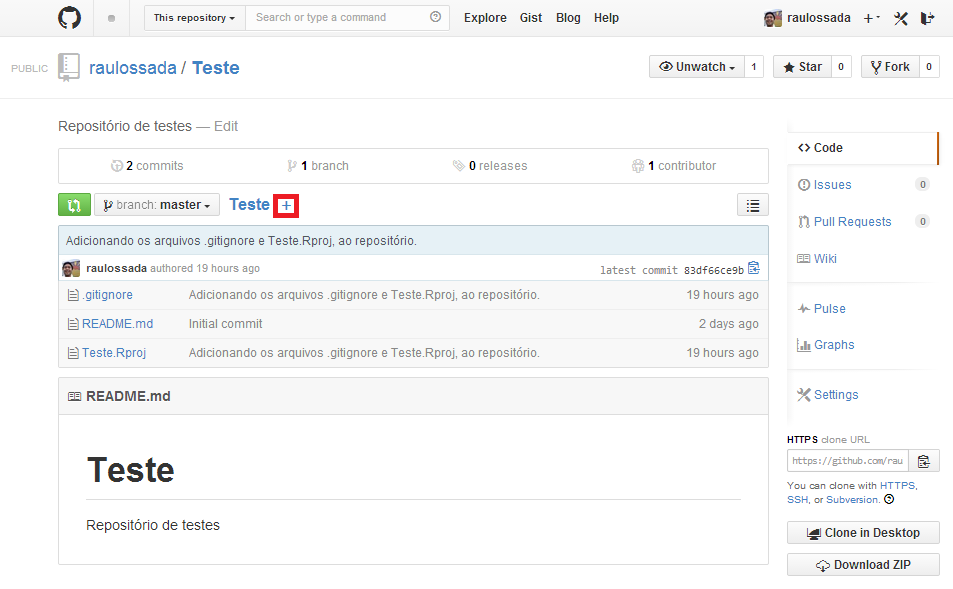
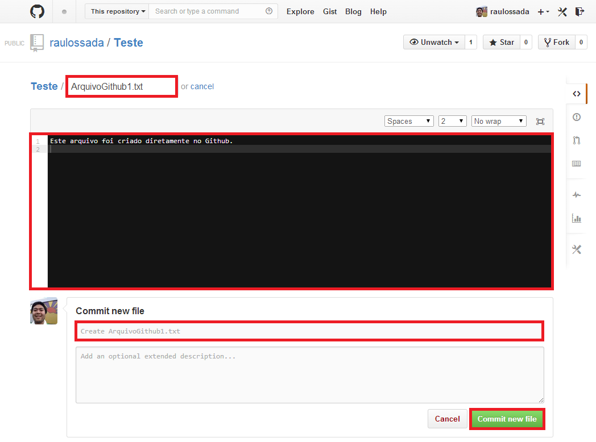
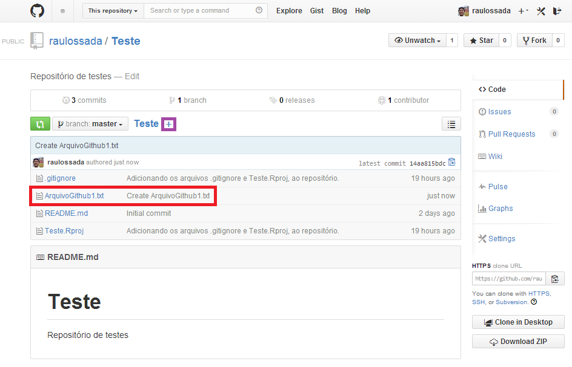
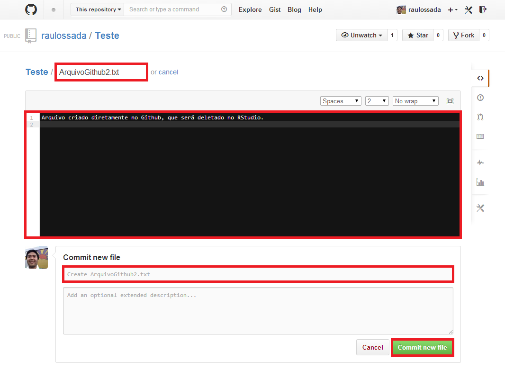
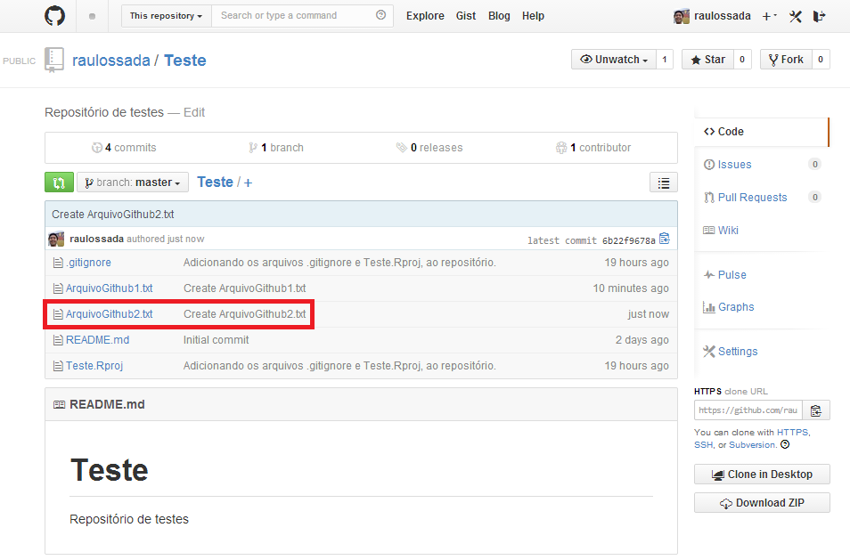
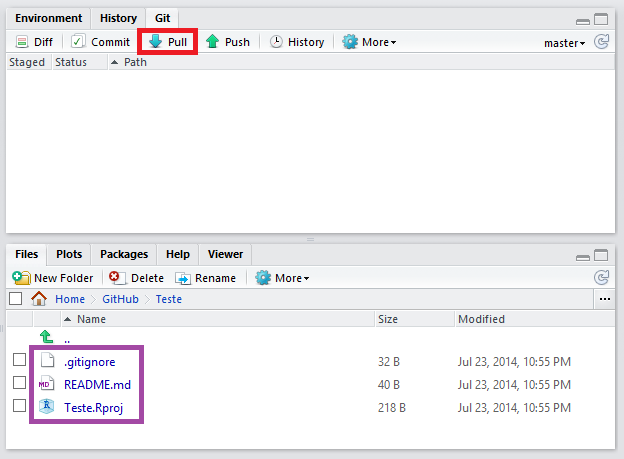
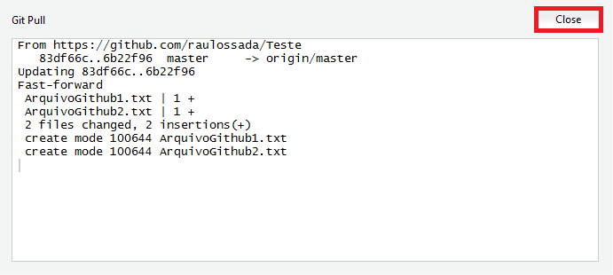
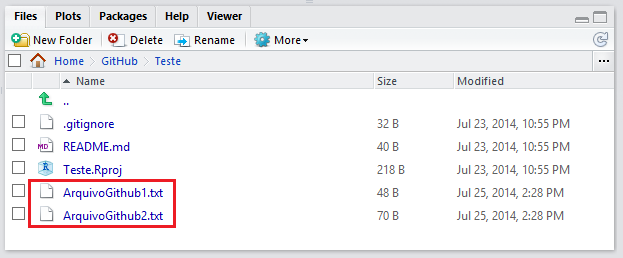

```{r knitsetup, echo=FALSE, results='hide', warning=FALSE, message=FALSE, cache=FALSE}
opts_knit$set(base.dir='./', fig.path='', out.format='md')
opts_chunk$set(prompt=TRUE, comment='', results='markup')
# See yihui.name/knitr/options for more Knitr options.
##### Put other setup R code here


# end setup chunk
```
# Pegando arquivos de um repositório

O termo relacionado à esta ação é o: 

+ **Pull** (do inglês, Puxar). Esse termo é usado quando se pega os arquivos de um repositório no Github e os salva localmente na sua máquina.

***

Nesta parte do exemplo, antes de fazer um **Pull**, vamos simular uma situação onde você teve que criar alguns arquivos diretamente no repositório do Github (ou que alguém da sua equipe submeteu alguns arquivos para o repositório).

1) Assim sendo, acesse o seu repositório no [Github](https://github.com/) e crie um novo arquivo. Para isso, clique no botão **+**:



***

2) Na tela que aparece, dê um nome para o seu arquivo.

3) Digite o conteúdo do arquivo.

4) Se você quiser, digite uma Mensagem de Commit, caso contrário, você pode usar a mensagem padrão do Github.

5) Clique no botão **Commit new file**, para finalizar a criação do arquivo:



***
 
6) Você será enviado para a tela inicial do seu repositório, e nela poderá observar que o arquivo foi criado.
 
7) Agora, vamos criar outro arquivo, usando o mesmo procedimento. Clique no botão **+**:


 
***
 
8) Dê um nome para o seu arquivo. Digite o conteúdo dele. E se quiser, digite uma Mensagem de Commit, ou use a mensagem padrão do Github. Clique no botão **Commit new file**:


 
***
 
9) Confira se o arquivo foi criado no seu repositório:


 
## Fazendo um Pull
 
1) Agora, abra o seu projeto no **RStudio**.
 
2) Observe que nem o ``ArquivoGithub1.txt`` ou o ``ArquivoGithub2.txt`` que acabamos de criar no Github aparecem no RStudio.

3) Para que os arquivos apareçam, precisamos fazer um **Pull** do repositório no Github, ou seja, pegar os arquivos que estão no repositório. Para isso, clique no botão **Pull**:



***

4) A seguinte janela irá aparecer, indicando que o Pull foi realizado com sucesso. Clique no botão **Close**, para fechar esta janela:



***

5) Agora, **note** que os arquivos que criamos diretamente no repositório aparecem no **RStudio**:



Parabéns! Acabamos de aprender a fazer um **Pull** de um repositório no Github.
