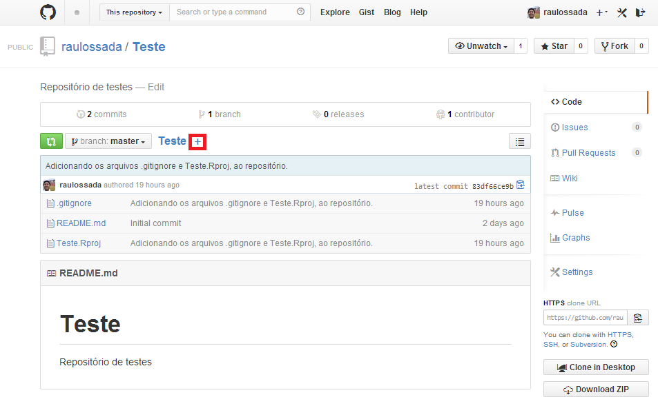
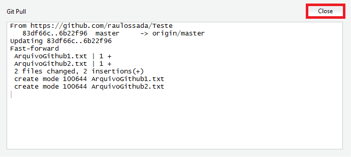

# Pegando arquivos de um repositório

O termo relacionado à esta ação é o: 

* **Pull** (do inglês, Puxar). Esse termo é usado quando se pega os arquivos de um repositório no Github e os salva localmente na sua máquina.

***

1) Para esta parte do exemplo, acesse o seu repositório no [Github](https://github.com/) e crie um novo arquivo. Para isso, clique no botão **+**:

***

2) Na tela que aparece, dê um nome para o seu arquivo.

3) Digite o conteúdo do arquivo.

4) Se você quiser, digite uma Mensagem de Commit, caso contrário, você pode usar a mensagem padrão do Github.

5) Clique no botão **Commit new file**, para finalizar a criação do arquivo:

***
 
6) Você será enviado para a tela inicial do seu repositório, e nela poderá observar que o arquivo foi criado.
 
7) Agora, vamos criar outro arquivo, usando o mesmo procedimento. Clique no botão **+**:

 
***
 
8) Dê um nome para o seu arquivo. Digite o conteúdo dele. E se quiser, digite uma Mensagem de Commit, ou use a mensagem padrão do Github. Clique no botão **Commit new file**:

 
***
 
9) Confira se o arquivo foi criado no seu repositório:

 
## Fazendo um Pull
 
Agora, volte para o seu projeto no RStudio.
 
Observe que nenhum dos 2 arquivos que acabamos de criar no Github aparecem no RStudio.

Para que os arquivos apareçam, precisamos fazer um **Pull** do repositório no Github, ou seja, pegar os arquivos que estão no repositório. Para isso, clique no botão ``Pull``:

- - -

A seguinte janela irá aparecer, indicando que o Pull foi realizado com sucesso:

Clique no botão **Close**, para fechar esta janela:

- - -

Note também que, agora, os arquivos que criamos diretamente no repositório aparecem no RStudio:

- - -

Parabéns! Você acaba de aprender como fazer um **Pull** de um repositório no Github.
