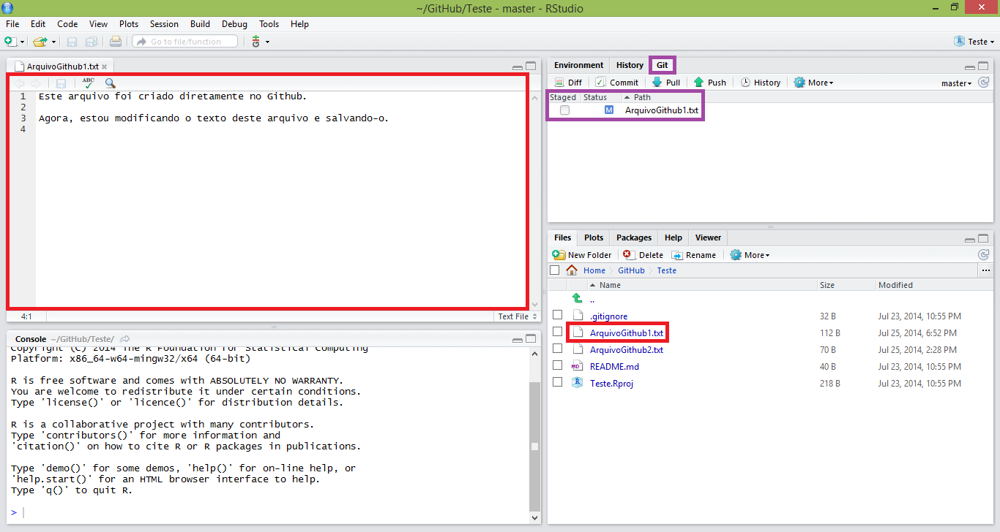
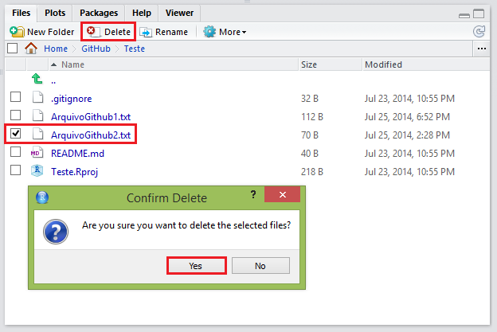
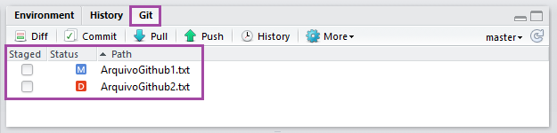
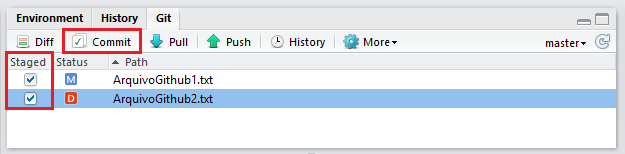
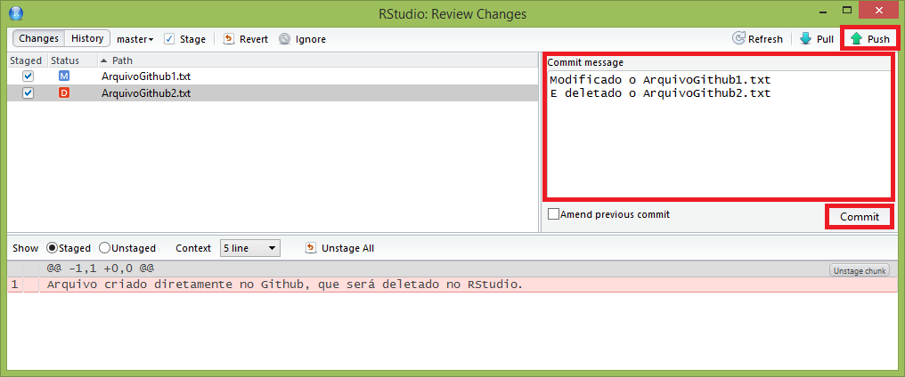
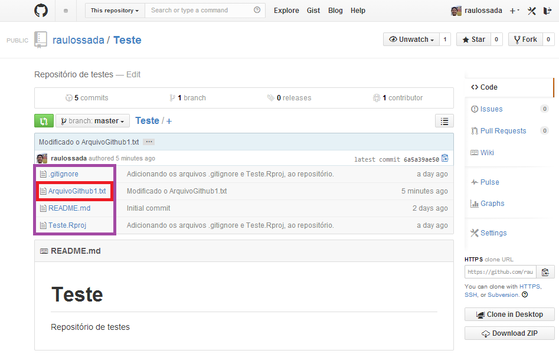
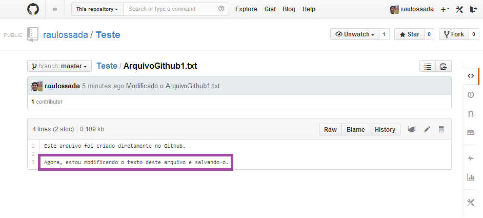

```{r knitsetup, echo=FALSE, results='hide', warning=FALSE, message=FALSE, cache=FALSE}
opts_knit$set(base.dir='./', fig.path='', out.format='md')
opts_chunk$set(prompt=TRUE, comment='', results='markup')
# See yihui.name/knitr/options for more Knitr options.
##### Put other setup R code here


# end setup chunk
```
# Status

Nesta seção, vamos conhecer mais 2 status que os arquivos podem ter quando trabalhamos com o GitHub em conjunto com o RStudio: o **Modified** e o **Deleted**.

1) Primeiro, vamos abrir e editar o arquivo: ``ArquivoGithub1.txt``.

2) Observe que após salvar as nossas modificações, o arquivo ``ArquivoGithub1.txt`` aparece na aba Git com o status **Modified** (do inglês, Modificado - indicando que o arquivo foi modificado):



3) Agora, marque o arquivo ``ArquivoGithub2.txt``, clique no botão **Delete** e clique no botão **Yes** (do inglês, Sim), para confirmar a exclusão do arquivo:



4) Veja que após apagarmos o arquivo, o mesmo aparece na aba Git com o status **Deleted** (do inglês, Excluído - indicando que o arquivo foi excluído):



5) Parabéns! Agora você conhece mais 2 status dos arquivos no Git. 

6) Agora, **lembre-se** que precisamos fazer o **Commit** e o **Push** para que nossas alterações sejam versionadas no repositório. Para isso, marque os dois arquivos e clique em **Commit**.



7) Na janela que aparece, escreva uma Mensagem de Commit e então faça o **Commit** e o **Push** dos arquivos para o repositório no GitHub.
(Caso tenha esquecido como fazer isso, consulte a [Seção 2.3 - Enviando arquivos à um repositório](example3.md) ):



8) Por fim, acesse o seu repositório no [GitHub](https://github.com/) e verifique se as suas alterações estão lá, ou seja, se o ``ArquivoGithub2.txt`` foi deletado:



9) E se o conteúdo do ``ArquivoGithub1.txt`` foi modificado:



Parabéns! Com as informações que vimos até agora já sabemos o básico para trabalhar com o RStudio e o GitHub! Agora é só se divertir!
