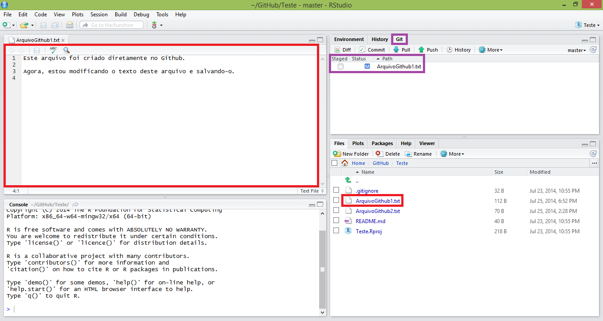
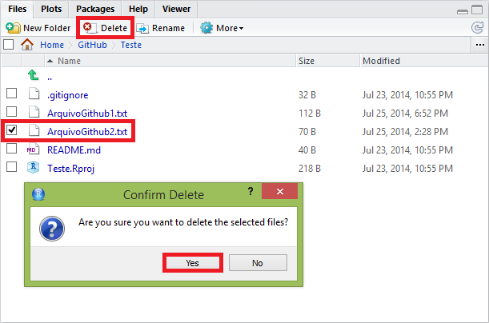
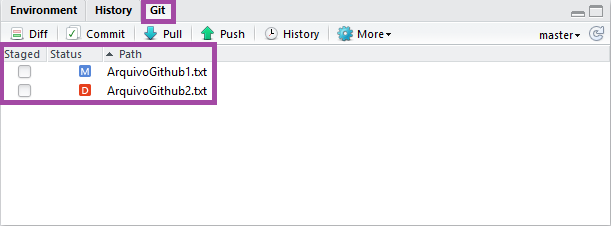
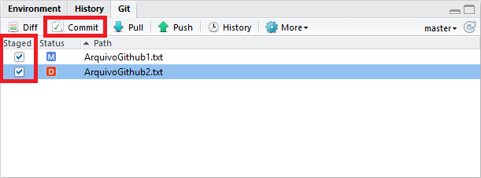
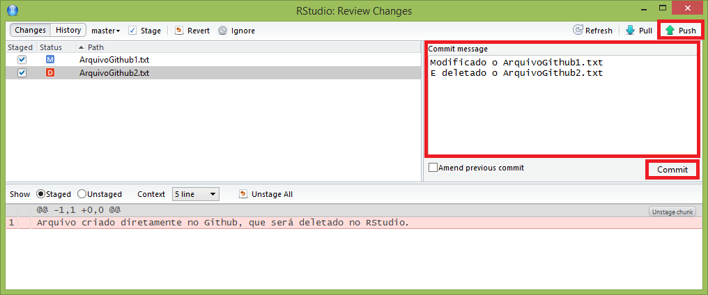
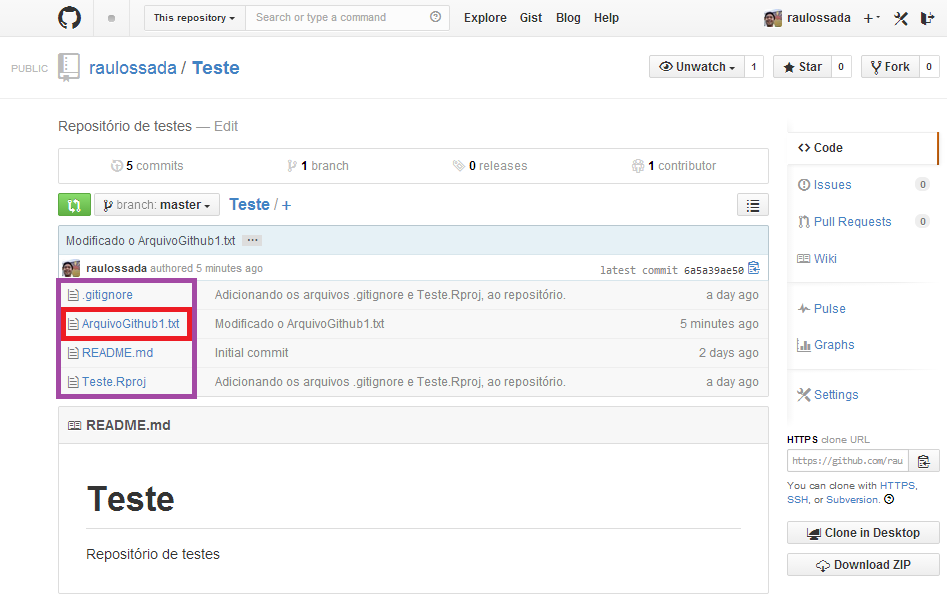
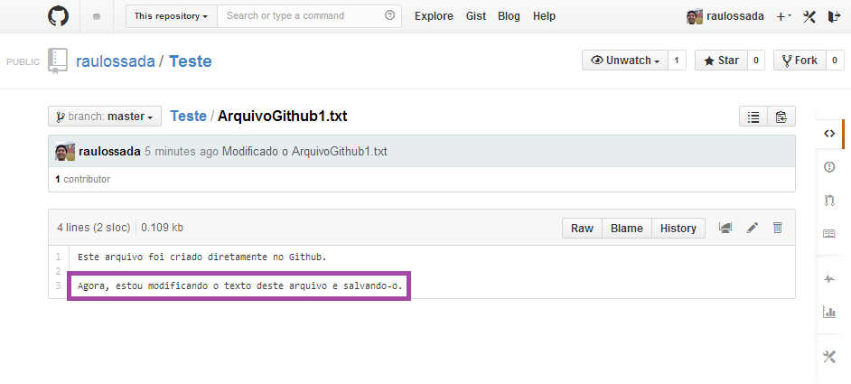

```{r knitsetup, echo=FALSE, results='hide', warning=FALSE, message=FALSE, cache=FALSE}
opts_knit$set(base.dir='./', fig.path='', out.format='md')
opts_chunk$set(prompt=TRUE, comment='', results='markup')
# See yihui.name/knitr/options for more Knitr options.
##### Put other setup R code here


# end setup chunk
```
# Extra

Pelo jeito, você ficou curioso para saber o que faremos com os arquivos que fizemos Pull na seção anterior.

Primeiro, vamos editar o arquivo ``ArquivoGithub1.txt``:

Observe que após salvar as suas modificações, o arquivo ``ArquivoGithub1.txt`` aparece na aba Git com o status **Modified** (A letra M envolto por uma caixa azul) - [Modificado]; Indicando que o arquivo foi modificado.



Agora, marque o arquivo ``ArquivoGithub2.txt``, clique no botão **Delete** e clique no botão **Yes** (Sim), para confirmar a exclusão do arquivo:



Veja que após deletarmos o arquivo, o mesmo aparece na aba Git com o status **Deleted** (A letra D envolta por uma caixa vermelha) - Indicando que o arquivo foi Deletado/Apagado/Excluído:



1) Agora, faça o Commit e o Push dos dois arquivos (Caso tenha esquecido como fazer isso, consulte a seção 2.2). E lembre-se de verificar o seu repositório para ver se as suas alterações estão lá.

2) Agora, na aba Git, marque os dois arquivos e clique em **Commit**:

3) Parabéns! Agora você conhece mais 2 Status dos arquivos no Git. Agora, vamos fazer o Commit e o Push para que nossas alterações sejam submetidas ao repositório. Para isso, marque os dois arquivos e clique em **Commit**.



Na janela que aparece, escreva uma mensagem de commit e então faça o **Commit** e o **Push** dos arquivos para o repositório no Github.
(Caso tenha esquecido como fazer isso, consulte a seção 2.2):



Por fim, acesse o seu repositório no [Github](https://github.com/) e verifique se as suas alterações estão lá, ou seja, se o ArquivoGithub2.txt foi deletado:



E se o ArquivoGithub1.txt foi modificado:



***
