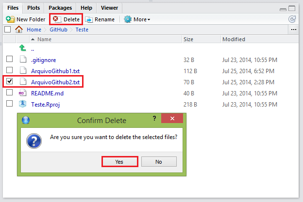
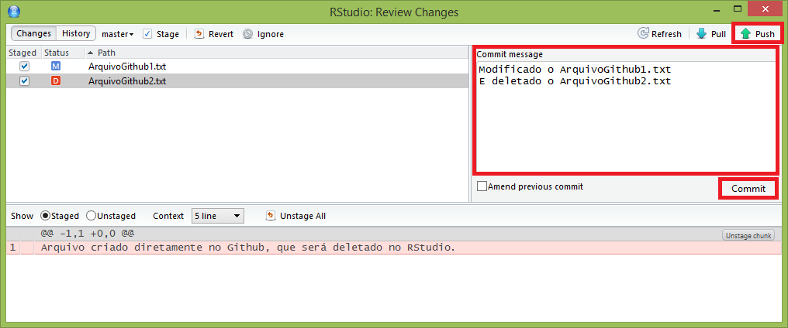
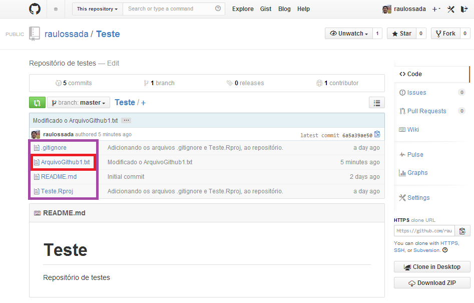

# Status

Nesta seção, vamos conhecer mais 2 status que os arquivos podem ter quando trabalhamos com o Github em conjunto com o RStudio: o **Modified** e o **Deleted**.

1) Primeiro, vamos abrir e editar o arquivo: ``ArquivoGithub1.txt``.

2) Observe que após salvar as nossas modificações, o arquivo ``ArquivoGithub1.txt`` aparece na aba Git com o status **Modified** (do inglês, Modificado - indicando que o arquivo foi modificado):

3) Agora, marque o arquivo ``ArquivoGithub2.txt``, clique no botão **Delete** e clique no botão **Yes** (do inglês, Sim), para confirmar a exclusão do arquivo:

4) Veja que após apagarmos o arquivo, o mesmo aparece na aba Git com o status **Deleted** (do inglês, Excluído - indicando que o arquivo foi excluído):

5) Parabéns! Agora você conhece mais 2 status dos arquivos no Git. 

6) Agora, **lembre-se** que precisamos fazer o **Commit** e o **Push** para que nossas alterações sejam versionadas no repositório. Para isso, marque os dois arquivos e clique em **Commit**.

7) Na janela que aparece, escreva uma Mensagem de Commit e então faça o **Commit** e o **Push** dos arquivos para o repositório no Github.
(Caso tenha esquecido como fazer isso, consulte a [Seção 2.3 - Enviando arquivos à um repositório](example3.md) ):

8) Por fim, acesse o seu repositório no [Github](https://github.com/) e verifique se as suas alterações estão lá, ou seja, se o ``ArquivoGithub2.txt`` foi deletado:

9) E se o conteúdo do ``ArquivoGithub1.txt`` foi modificado:

Parabéns! Com as informações que vimos até agora já sabemos o básico para trabalhar com o RStudio e o Github! Agora é só se divertir!
