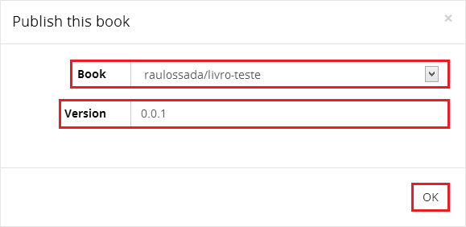
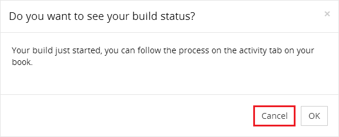

```{r knitsetup, echo=FALSE, results='hide', warning=FALSE, message=FALSE, cache=FALSE}
opts_knit$set(base.dir='./', fig.path='', out.format='md')
opts_chunk$set(prompt=TRUE, comment='', results='markup')
# See yihui.name/knitr/options for more Knitr options.
##### Put other setup R code here


# end setup chunk
```
# Publicando um GitBook

Nesta seção, vamos ver como publicar um GitBook.

1) Faça uma conta no [GitBook](https://www.gitbook.io/).

2) Acesse a sua conta e clique no botão **+**:


***

3) Na nova tela, no campo **Title** (do inglês, Título), escreva o título do seu livro. Automaticamente o GitBook irá preencher o campo **Book name** (do inglês, Nome do livro).

4) Selecione uma das opções a seguir:

+ **Public** (do inglês, Público): Qualquer pessoa pode ver o seu livro e você decide quem pode fazer commit.

+ **Private** (do inglês, Privado): Você decide quem pode ver e fazer commit para o seu livro.

Neste exemplo, iremos selecionar a opção **Private**. Vale lembrar que essa opção pode ser alterada depois acessando os **Settings** (do inglês, Configurações) do livro.

5) Se quiser, escreva uma breve descrição do livro no campo **Description** (do inglês, Descrição).

6) Se quiser, no campo **Categories**, selecione uma ou mais categorias para o seu livro.

7) Clique no botão **Create Book**:


***

Nesta tela, vemos que o espaço para o livro foi criado com sucesso, agora precisamos inserir o seu conteúdo.


***

8) Baixe e abra o [Book Editor do GitBook](https://www.gitbook.io/editor/download).

9) Vá em **File** -> **Open...** e selecione a pasta onde se encontram os arquivos ``README.md`` e ``SUMMARY.md`` do seu livro, para abrir o seu livro:


***

10) Com o livro aberto, vá em **Book** -> **Publish As...**:


***

11) Na janela que aparece, no campo **Book**, selecione o seu livro.

12) E no campo **Version**, digite a versão do seu livro. Neste exemplo, usaremos o [Versionamento Semântico](http://semver.org/lang/pt-BR/), mas você pode usar o estilo de versionamento que quiser.

13) Clique em **OK**:



***

14) Nesta nova janela, clique em **Cancel** para fechá-la:



***

15) Acesse a sua conta no [GitBook](https://www.gitbook.io/). E clique em **Your Books**:


***

16) Nesta tela, clique no seu livro, no caso **Livro Teste**:


***

Nesta tela, como você pode ver essa versão do livro está pronta para leitura. (Caso nem todas as opções do seu livro apareçam, espere alguns minutos e recarregue a página, pois demora um pouco para o servidor do Gitbook montar o livro).

17) Para ler a versão Web do seu livro, clique no botão **Read**:


***

Parabéns! Agora, divirta-se editando o seu livro.


